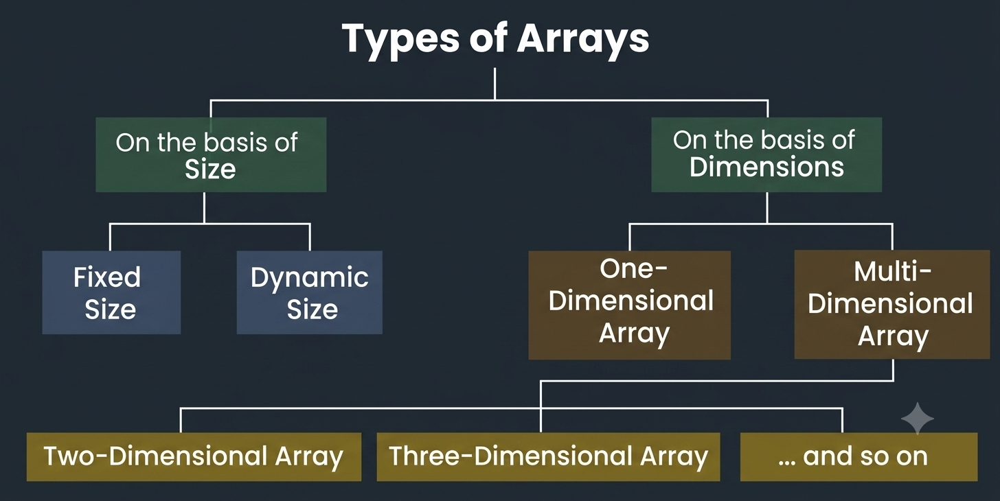

# Array

## What is Array?

An `array` is a special type of object designed specifically for storing and managing ordered collections of data. Array store multiple values(it can be any datatype) in a single variable. Arrays are dynamic, meaning their size can grow or shrink automatically as elements are added or removed.

* Declaration:

```javascript
let fruits = ["Apple", "Orange", "Plum"]; // Recommended
let arr = new Array("Apple", "Pear");      // Avoid! See why below
```

* *Indices*: 0-indexed. Access elements using `arr[index]`.
* The *`.at()`* Method: Allows using negative indices to grab elements from the end of the array.

    ```javascript
        fruits.at(-1); // "Plum" (Same as fruits[fruits.length - 1])   
    ```

* **Type of Arrays**
  * Arrays can be classified in two ways:
    1. On the basis of Size
    2. On the basis of Dimensions
    
  * 1- *Types of Arrays on the basis of Size*
    * *Dynamic Sized Arrays*: The size of the array changes as per user requirements during execution of code so the coders do not have to worry about sizes. They can add and removed the elements as per the need. The memory is mostly dynamically allocated and de-allocated in these arrays.

    ```javascript
    // Dynamic Sized Array
    let arr = new Array();
    ```
  
  * 2- *Types of Arrays on the basis of Dimensions*
    * *One-dimensional Array(`1-D Array`)*: You can imagine a 1d array as a row, where elements are stored one after another.
    
    * *Multi-dimensional Array*: A multi-dimensional array is an array with more than one dimension. We can use multidimensional array to store complex data in the form of tables, etc. We can have `2-D arrays`, `3-D arrays`, `4-D arrays` and so on.
      * *Two-Dimensional Array(`2-D Array` or Matrix)*: `2-D` Multidimensional arrays can be considered as an array of arrays or as a matrix consisting of rows and columns.
      

**Queue & Stack Operations**:
JavaScript arrays can act as both queues (FIFO) and stacks (LIFO).

## **Array Methods**

* **Add/remove items**:
  * `push(...items)` ➔ Adds item(s) to the end
  * `pop()` ➔ Removes & returns item from the end
  * `shift()` ➔ Removes & returns item from the beginning
  * `unshift(...items)` ➔ Adds item(s) to the beginning


  * *`splice()`* ➔ remove one or more elements from any position in an array and optionally insert new elements in their place, modifying the original array. *How It Works*: The syntax is `arr.splice(start, deleteCount, item1, item2, ...)`. For example:

    ```javascript
    //example 1
    let fruits = ["apple", "mango"];

    // Start at index 1, delete 0 elements, and insert "banana"
    fruits.splice(1, 0, "banana");

    console.log(fruits); 
    // Output: ["apple", "banana", "mango"] 
    
    //example 2

    let arr = ["I", "study", "JavaScript", "right", "now"];

    // remove 3 first elements and replace them with another, Starts at index 0 and stops BEFORE index 3
    arr.splice(0, 3, "Let's", "dance");

    console.log( arr ) // now ["Let's", "dance", "right", "now"]
    ```

  * `slice()` ➔ `.slice(start, end)` copies from the *start* index, stops just before the *end* index, and leaves the original array untouched. for example:
  
    ```javascript
    const arr = ["apple", "banana", "orange"];

    // Starts at index 1 ("banana") and stops BEFORE index 2 ("orange")
    const newArr = arr.slice(1, 2); 

    console.log(newArr); 
    // Output: ["banana"]

    console.log(arr); 
    // Output: ["apple", "banana", "orange"] (Original array is untouched!)
    ```
  
  * `concat()` ➔ The `concat()` (short for *concatenate*) method is used to merge two or more arrays or values together. It does not modify the original arrays. for example:

    ```javascript
    let arr1 = [1, 2, 3];
    let arr2 = [4, 5, 6];

    // Merging arr1 and arr2 into a new array
    let arr3 = arr1.concat(arr2); 

    console.log(arr3); 
    // Output: [1, 2, 3, 4, 5, 6]
    ```

* **To search among elements**
  * `indexOf/lastIndexOf(item, pos)` ➔ look for `item` starting from position `pos`, and return the *index* or `-1` if not found.
  * `includes(value)` ➔ returns `true` if the array has `value`, otherwise `false`.
  * `find/filter(func)` ➔ filter elements through the function, return first/all values that make it return `true`.
  * `findIndex` ➔ is like `find`, but returns the `index` instead of a `value`.

* **To iterate over elements**
  * `forEach(func)` ➔ calls func for every element, does not return anything.
* **To transform the array**
  * `map(func)` ➔ creates a new array from results of calling `func` for every element. The `arr.map` method is one of the most useful and often used. It calls the function for each element of the array and returns the array of results. The syntax is:

    ```javascript
    let result = arr.map(function(item, index, array) {
      // returns the new value instead of item
    });
    ```

  * `sort(func)` ➔ sorts the array in-place, then returns it.
  * `reverse()` ➔ reverses the array in-place, then returns it.
  * `split/join` ➔ convert a string to array and back.
  * `reduce/reduceRight(func, initial)` ➔ calculate a single value over the array by calling func for each element and passing an intermediate result between the calls.
**The `length` Property**

* It is not strictly the count of elements; it is actually the greatest numeric index plus one.
* It is writable! If you manually decrease length, the array is permanently truncated.

    ```javascript
    let arr = [1, 2, 3, 4, 5];
    arr.length = 2; // arr is now [1, 2]
    arr.length = 5; // arr[3] is now undefined (the values are gone forever!)
    ```

* 💡 Quick Tip: Clear an array completely with `arr.length = 0;`.

**Key Pitfalls & Best Practices**:

* *⚠️ Don't treat arrays like generic objects*: Because arrays are objects, you can technically add custom properties (e.g., `arr.age = 25`) or leave massive index holes (e.g., setting `arr[0]` and `arr[9999]`). Doing this turns off array-specific engine optimizations, making your code run much slower.
* *⚠️ Avoid `new Array(number)`*: If you call `new Array()`with a single number argument, it doesn't create an array containing that number. Instead, it creates an empty array with that length but no actual elements:

    ```javascript
    let arr = new Array(2); 
    console.log(arr[0]);     // undefined!
    console.log(arr.length); // 2
    ```

* *⚠️ Don't use `for..in` loops*:
  * `for (let i = 0; i < arr.length; i++)` – Classic, fast, compatible.
  * `for (let item of arr)` – Modern, clean, only iterates over elements (recommended).
  * `for (let key in arr)` – Avoid for arrays. It is optimized for generic objects, iterates over non-numeric properties, and is 10 to 100 times slower.
* *⚠️ Don't compare arrays using `==` or `===`*: Arrays are objects, so comparison operators only check if they point to the exact same memory reference.

    ```javascript
    [] == []; // false (they are different object instances)
    ```

To compare arrays, you must write a loop or use array utility methods to compare them item-by-item.
