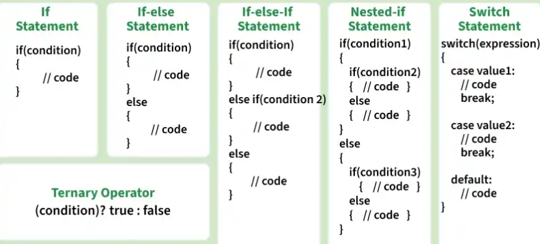

# Conditional Statements in Javascript

Conditional statements help a program make decisions. They check whether a condition is *true* or *false* and execute different blocks of code based on the result.

* Types of Conditional Statements:
  * *`if` Statement* → The if statement checks a condition and executes a block of code only when the condition is true. example:

    ```javascript
    let x = 7;

    if (x > 0) {
        console.log("x is positive");
    }  
    // x is positive  
    ```

  * *`if-Else` Statement* → The if-else statement checks a condition and runs one block of code if the condition is true, and another block of code if the condition is false. example:

    ```javascript
    let x = 7;

    if (x > 0) {
        console.log("x is positive");
    }
    else {
        console.log("x is not positive");
    }
    // x is positive
    ```

  * *`if-Else-If` Statement* → The `if-else if` statement is used to check multiple conditions.The program evaluates each condition one by one and executes the block of code for the first condition if that is true. example:

    ```javascript
    let x = 0;

    if (x > 0) {
        console.log("x is positive");
    }
    else if (x < 0) {
        console.log("x is negative");
    }
    else {
        console.log("x is zero");
    }
    // x is zero
    ```

  * *`Switch` Statement* → The switch statement checks a variable against multiple possible values. Each option is written as a case, and the program executes the matching case. A break statement is usually used to stop execution after a case runs. example:

    ```javascript
    let day = 2;

    switch(day) {
        case 1:
            console.log("Monday");
            break;
        case 2:
            console.log("Tuesday");
            break;
        case 3:
            console.log("Wednesday");
            break;
        default:
            console.log("Invalid day!");
    }
    // Tuesday
    ```

  * *Ternary Operator* → The ternary operator is a short way to write an if-else statement. It evaluates a condition and returns one value if the condition is true, and another value if the condition is false.

    ```javascript
    let x = 10;
    console.log(x > 0 ? "x is positive" : "x is not positive");
    ```


